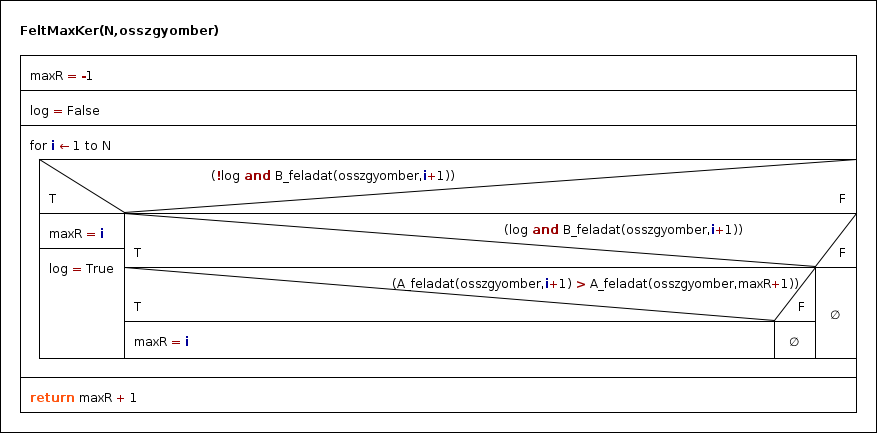

# ZH Feladat
Aprajafalván Captain Törp felkért minket, hogy segítsünk kitalálni neki, hogy melyik napon lenne érdemes több gyömbér szörpöt készíteni. Ennek eldöntéséhez feljegyezte, hogy hány szörpöt kellett készítenie az elmúlt napok folyamán.
Úgy gondolja, hogy ha az alábbi kérdésekre válaszolunk akkor az neki most megfelelő lesz:
 * Számoljuk meg az 1 napra eső átlagos forgalmat.
 * Döntsük el, hogy volt-e aznap minden elkészített adagból legalább 5 darab.
 * Határozzuk meg azt a napot, ahol a legnagyobb volt az átlagos forgalom úgy, hogy minden elkészített adagból legalább 5 darab készült.

## Segítség:
Használjunk egy struct-ot, aminek két eleme van, az egyik egy int N, a másik pedig egy tömb ami maximum 100 elemet tartalmazhat. Ez ugyebár egy napot fog definiálni. 
A main()-ben pedig definiáljunk egy tömböt, ami napot tartalmaz az lesz az ```osszgyomber``` és annak ismételten a maximum elemszáma 100 lehet.

## Bemenet
Bemenő adatként Captain Törp consolon fogja begépelni az adatokat (plusz pontért nagy fájlt fog nekünk adni) az elmúlt x napban eladott gyömbér szörpről úgy, hogy az első rekord hétfői (majd kedd,szerda,... és vasárnap után ismét hétfő). A fájl a feljegyzett napok számával kezdődik, majd sorban 1-1 nap feljegyzései követik, úgy hogy először megadja, hogy az adott napon mennyiszer kellett új adagot készítenie, majd a készített szörpök számai sorban.
```
10
3 5 10 20
2 10 12
3 12 10 5
1 5
1 2
0
1 2
3 50 50 100
2 5 10
1 5
```

## Output feladatonként

 * Az első feladatban kell definiálni egy függvényt, aminek paraméterei között szerepel egy szám, amely segítségével megadhatjuk, hogy hanyadik nap átlagos forgalmát akarjuk meghatározni. Például:
```
//Output: 11 // (10+12) / 2
std::cout << A_feladat(osszgyomber, 2) << std::endl;
```
 * A második feladatban is hasonlóan járunk el mint az első feladatban. Legyen egy szám, amely segítségével megadjuk, hogy hanyadik napról akarjuk eldönteni, hogy minden elkészített adagból legalább 5 darab készült-e.
```
//Output: 1 // 5 >= 5; 10 >= 5; 20 >= 5; -> Minden érték eleget tesz a feltételnek.
std::cout << B_feladat(osszgyomber, 1) << std::endl;
```

 * A harmadik feladatban már nincs plusz bemenő paraméter. Így egy index értékkel fog visszatérni, hogy melyik napon volt a legnagyobb az átlagos forgalom úgy, hogy minden elkészített adagból legalább 5 darab készült.

```
8
```

### Harmadik feladathoz Algoritmus:


## Tundivalók
https://github.com/Locutus18/Programozasi_Alapismeretek/blob/master/08-ZH%20(Gepes)/README.md
