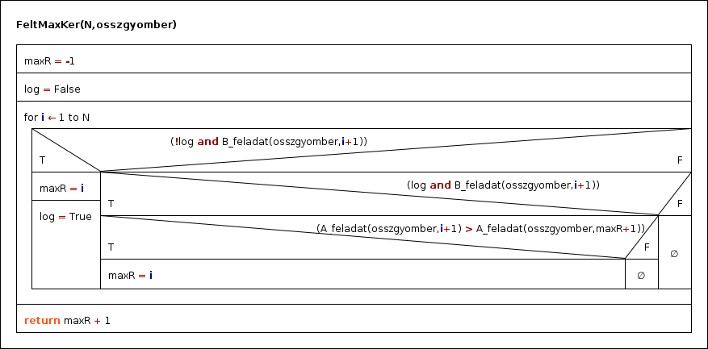

# ZH Feladat
Egy pizzéria felkért minket, hogy segítsünk kitalálni nekik, hogy melyik napon lenne érdemes fejleszteni (tovább nyitvatartani vagy több felszolgálót behívni). Ennek eldöntéséhez feljegyezték, hogy mennyi bevételük volt az elmúlt napok folyamán. Úgy gondolják, hogy ha megválaszoljuk az alábbi kérdéseket az nekik most megfelelő lesz:
Úgy gondolja, hogy ha az alábbi kérdésekre válaszolunk akkor az neki most megfelelő lesz:
 * Számoljuk meg az 1 napra eső forgalmat.
 * Döntsük el, hogy egy nap minden elkeszitett adag nagyobb-e mint az adott napra eso atlagos forgalom.
 * Határozzuk meg azt a napot, ahol a legnagyobb volt a forgalom úgy, hogy minden elkészített adag nagyobb mint az atlagos forgalom.

## Bemenet
Bemenő adatként a pizzéria consolon fogja begépelni az adatokat (plusz pontért nagy fájlt fog nekünk adni) az elmúlt x napban eladott gyömbér szörpről úgy, hogy az első rekord hétfői (majd kedd,szerda,... és vasárnap után ismét hétfő). A fájl a feljegyzett napok számával kezdődik, majd sorban 1-1 nap feljegyzései követik, úgy hogy először megadja, hogy az adott napon mennyiszer kellett új adagot készítenie, majd a készített szörpök számai sorban.
```
10
3 5 10 20
2 10 12
3 12 10 5
1 5
1 2
0
1 2
3 50 50 100
2 5 10
1 5
```

## Output feladatonként

 * Az első feladatban kell definiálni egy függvényt, aminek paraméterei között szerepel egy szám, amely segítségével megadhatjuk, hogy hanyadik nap forgalmát akarjuk meghatározni. Például:
```
//Output: 22 // 10+12
std::cout << A_feladat(osszeladas, 2) << std::endl;
```
 * A második feladatban is hasonlóan járunk el mint az első feladatban. Legyen egy szám, amely segítségével megadjuk, hogy hanyadik napról akarjuk eldönteni, hogy minden elkészített adag nagyobb-e mint az adott napra eso atlagos forgalom.
```
//Output: 1 // 5 >= 5; 10 >= 5; 20 >= 5; -> Minden érték eleget tesz a feltételnek.
std::cout << B_feladat(osszeladas, 1) << std::endl;
```

 * A harmadik feladatban már nincs plusz bemenő paraméter. Így egy index értékkel fog visszatérni, hogy melyik napon volt a legnagyobb az forgalom úgy, hogy minden elkészített adagból több készült mint az atlagos forgalom.


### Harmadik feladathoz Algoritmus:


## Tundivalók
https://github.com/Locutus18/Programozasi_Alapismeretek/blob/master/08-ZH%20(Gepes)/README.md
